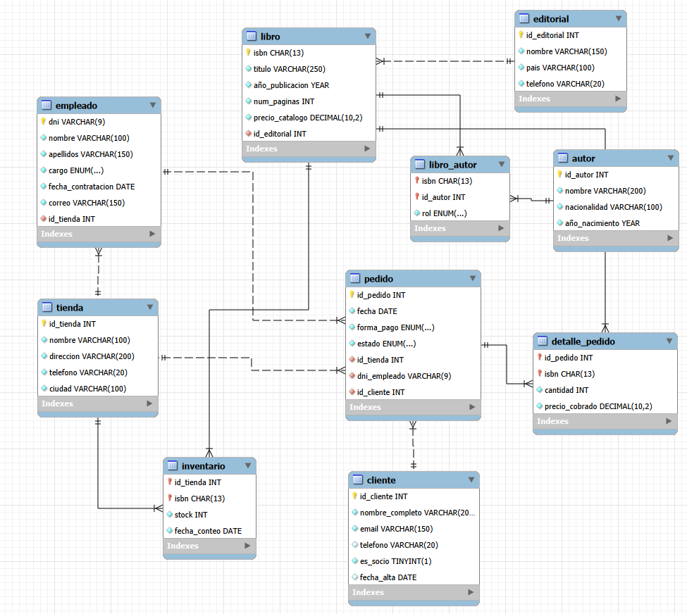

# Base de datos de Páginas de Villa Serena

## 1. Resumen del caso
La librería Páginas de Villa Serena opera a través de tres tiendas físicas (Centro, Ribera y Universidad). Ahora mismo gestiona su inventario, stock, empleados, clientes y ventas mediante hojas de cálculo, lo que genera errores de sincronización y pérdida para rastrear los precios y el inventarios. El objetivo de este sistema es centralizar la información mediante una base de datos entidad relacion que permita controlar el stock específico por ubicación, registrar clientes y socios, y trazar cada venta con precisión histórica de precios y empleados intervinientes.
## 2. Análisis del caso

### 2.1 Entidades y atributos

| Entidad | Atributos encontrados | Fragmento del texto |
|:---|:---|:---|
| Tienda | id_tienda, nombre, direccion, telefono, ciudad | La librería cuenta con tres tiendas: Centro, Ribera y Universidad. De cada tienda se guarda su nombre, dirección, teléfono y ciudad. |
| Empleado | dni, nombre, apellidos, cargo, fecha_contratacion, correo, __id_tienda FK__ | De cada empleado se registra el DNI, nombre, apellidos, puesto, fecha de contratación y correo electrónico. Cada empleado trabaja en una tienda. |
| Cliente | id_cliente, nombre_completo, email, telefono, es_socio, fecha_alta | Se registran los clientes, tanto socios como no socios, con su nombre y correo electrónico. |
| Editorial | id_editorial, nombre, pais, telefono | De cada editorial se guarda el nombre, país y teléfono de contacto. |
| Libro | isbn, titulo, año_publicacion, num_paginas, precio_catalogo, __id_editorial FK__ | Cada libro se identifica por su ISBN de 13 dígitos y se guarda su título, año de publicación, número de páginas y precio de catálogo. Cada libro pertenece a una editorial. |
| Autor | id_autor, nombre, nacionalidad, año_nacimiento | De cada autor se registra el nombre, nacionalidad y año de nacimiento. |
| Libro_Autor | __isbn FK__, __id_autor FK__, rol | Un libro puede tener varios autores y cada autor puede escribir varios libros. Se indica si el autor es principal o colaborador. |
| Inventario | __id_tienda FK__, __isbn FK__, stock, fecha_conteo | Para cada combinación de libro y tienda se registra el stock y la fecha del último recuento. |
| Pedido | id_pedido, fecha, forma_pago, estado, __id_tienda FK__, __dni_empleado FK__, __id_cliente FK__ | Cada pedido se realiza en una tienda, lo gestiona un empleado y corresponde a un cliente. Se registra la fecha, forma de pago y estado. |
| Detalle_Pedido | __id_pedido FK__, __isbn FK__, cantidad, precio_cobrado | Los pedidos pueden contener varios libros y se registra la cantidad de cada uno y el precio realmente cobrado. |


### 2.2 Relaciones

| Relación | Cardinalidad | Justificación |
|:---|:---:|:---|
| Tienda – Empleado | 1:N | Una tienda puede tener varios empleados y cada empleado trabaja en una sola tienda. |
| Editorial – Libro | 1:N | Una editorial puede publicar muchos libros, pero cada libro pertenece a una única editorial. |
| Libro – Autor | N:M | Un libro puede tener varios autores y un autor puede escribir varios libros. Se resuelve con la tabla Libro_Autor. |
| Tienda – Libro | N:M | Una tienda puede tener muchos libros y un libro puede estar disponible en varias tiendas. Se resuelve con la tabla Inventario. |
| Tienda – Pedido | 1:N | Una tienda puede registrar muchos pedidos, pero cada pedido se realiza en una sola tienda. |
| Empleado – Pedido | 1:N | Un empleado puede gestionar muchos pedidos, pero cada pedido lo gestiona un único empleado. |
| Cliente – Pedido | 1:N | Un cliente puede realizar muchos pedidos, pero cada pedido corresponde a un único cliente. |
| Pedido – Libro | N:M | Un pedido puede incluir varios libros y un libro puede aparecer en muchos pedidos. Se resuelve con la tabla Detalle_Pedido. |

### 2.3 Datos descartados

| Dato | Decisión | Motivo |
|:---|:---|:---|
| Total del pedido | No se almacena. | Se calcula sumando __cantidad * precio_cobrado__. |
| Precio pagado en ventas anteriores | Se guarda en __Detalle_Pedido__ | El precio de catálogo puede cambiar; así se conserva el precio realmente cobrado en cada venta. |
| Lista de autores en un único campo | No se almacena en __Libro__. | Se utiliza __Libro_Autor__ para representar la relación entre libros y autores. |
| Datos de la editorial repetidos en cada libro | Se almacenan en __Editorial__. | Se evita duplicar el nombre, país y teléfono de una misma editorial. |
| Stock de cada libro por tienda | Se almacena en __Inventario__. | La cantidad disponible depende de la combinación de libro y tienda. |
| Historial de traslados de empleados | No se almacena. | El caso indica que no es necesario registrar los cambios de tienda de los empleados. |
| Total de ventas por tienda | No se almacena. | Se calcula a partir de los pedidos y sus detalles para el periodo solicitado. |
| Tabla independiente para socios | No se crea. | Se utiliza __Cliente__ con el atributo __es_socio__ para distinguir a los socios de los no socios. |

## 3. Reglas de negocio
-Cada empleado está vinculado obligatoriamente a una única tienda de trabajo.

-Un libro pertenece de manera estricta a una única editorial.

-El stock de un libro se gestiona de forma independiente para cada sucursal (tienda).

-Los precios de venta en los pedidos deben reflejar de forma persistente el valor cobrado en el momento de la transacción, protegiendo la factura frente a futuras fluctuaciones del precio de catálogo.

-El correo electrónico del cliente/socio debe ser un dato único dentro del sistema para permitir avisos comerciales y gestión de cuentas.
## 4. Diagrama entidad-relación




| Relación | Tipo | Cómo se resuelve |
|:---|:---:|:---|
| Tienda – Empleado | 1:N |`empleado.id_tienda FK` |
| Editorial – Libro | 1:N | `libro.id_editorial FK` |
| Libro – Autor | N:M | `Tabla intermedia libro_autor, con isbn FK, id_autor FK y rol` |
| Tienda – Libro | N:M | `Tabla intermedia inventario, con id_tienda FK, isbn FK, stock y fecha_conteo` |
| Tienda – Pedido | 1:N | `pedido.id_tienda FK` |
| Empleado – Pedido | 1:N | `pedido.dni_empleado FK` |
| Cliente – Pedido | 1:N | `pedido.id_cliente FK` |
| Pedido – Libro | N:M | `Tabla intermedia detalle_pedido, con id_pedido FK, isbn FK, cantidad y precio_cobrado` |

## 5. Modelo lógico
tienda (id_tienda [PK], nombre, direccion, telefono, ciudad)

editorial (id_editorial [PK], nombre, pais, telefono)

autor (id_autor [PK], nombre, nacionalidad, año_nacimiento)

libro (isbn [PK], titulo, año_publicacion, num_paginas, precio_catalogo, id_editorial [FK])

Libro_Autor (isbn [PK/FK], id_autor [PK/FK], rol)

Inventario (id_tienda [PK/FK], isbn [PK/FK], stock, fecha_conteo)

empleado (dni [PK], nombre, apellidos, cargo, fecha_contratacion, correo, id_tienda [FK])

cliente (id_cliente [PK], nombre_completo, email [UNIQUE], telefono, es_socio, fecha_alta)

pedido (id_pedido [PK], fecha, forma_pago, estado, id_tienda [FK], dni_empleado [FK], id_cliente [FK])

Detalle_Pedido (id_pedido [PK/FK], isbn [PK/FK], cantidad, precio_cobrado)
## 6. Script SQL (schema.sql)

**Tabla 1**

```sql
CREATE TABLE tienda (
    id_tienda INT AUTO_INCREMENT,
    nombre VARCHAR(100) NOT NULL,
    direccion VARCHAR(200) NOT NULL,
    telefono VARCHAR(20) NOT NULL,
    ciudad VARCHAR(100) NOT NULL,
    PRIMARY KEY (id_tienda)
);
```

**Tabla 2**

```sql
CREATE TABLE empleado (
    dni VARCHAR(9),
    nombre VARCHAR(100) NOT NULL,
    apellidos VARCHAR(150) NOT NULL,
    cargo ENUM('librero', 'cajero', 'encargado') NOT NULL,
    fecha_contratacion DATE NOT NULL,
    correo VARCHAR(150) NOT NULL,
    id_tienda INT NOT NULL,
    PRIMARY KEY (dni),
    FOREIGN KEY (id_tienda)
        REFERENCES tienda(id_tienda)
        ON UPDATE CASCADE
        ON DELETE RESTRICT,
    UNIQUE (correo)
);
```

**Tabla 3**

```sql
CREATE TABLE cliente (
    id_cliente INT AUTO_INCREMENT,
    nombre_completo VARCHAR(200) NOT NULL,
    email VARCHAR(150) NOT NULL,
    telefono VARCHAR(20),
    es_socio BOOLEAN NOT NULL DEFAULT FALSE,
    fecha_alta DATE,
    PRIMARY KEY (id_cliente),
    UNIQUE (email)
);
```

**Tabla 4**

```sql
CREATE TABLE editorial (
    id_editorial INT AUTO_INCREMENT,
    nombre VARCHAR(150) NOT NULL,
    pais VARCHAR(100) NOT NULL,
    telefono VARCHAR(20) NOT NULL,
    PRIMARY KEY (id_editorial)
);
```

**Tabla 5**

```sql
CREATE TABLE libro (
    isbn CHAR(13),
    titulo VARCHAR(250) NOT NULL,
    año_publicacion YEAR NOT NULL,
    num_paginas INT NOT NULL,
    precio_catalogo DECIMAL(10,2) NOT NULL,
    id_editorial INT NOT NULL,
    PRIMARY KEY (isbn),
    FOREIGN KEY (id_editorial)
        REFERENCES editorial(id_editorial)
        ON UPDATE CASCADE
        ON DELETE RESTRICT,
    CHECK (num_paginas > 0),
    CHECK (precio_catalogo >= 0)
);
```

**Tabla 6**

```sql
CREATE TABLE autor (
    id_autor INT AUTO_INCREMENT,
    nombre VARCHAR(200) NOT NULL,
    nacionalidad VARCHAR(100) NOT NULL,
    año_nacimiento YEAR NOT NULL,
    PRIMARY KEY (id_autor)
);
```

**Tabla 7**

```sql
CREATE TABLE libro_autor (
    isbn CHAR(13),
    id_autor INT,
    rol ENUM('principal', 'colaborador') NOT NULL,
    PRIMARY KEY (isbn, id_autor),
    FOREIGN KEY (isbn)
        REFERENCES libro(isbn)
        ON UPDATE CASCADE
        ON DELETE CASCADE,
    FOREIGN KEY (id_autor)
        REFERENCES autor(id_autor)
        ON UPDATE CASCADE
        ON DELETE CASCADE
);
```

**Tabla 8**

```sql


CREATE TABLE inventario (
    id_tienda INT,
    isbn CHAR(13),
    stock INT NOT NULL DEFAULT 0,
    fecha_conteo DATE NOT NULL,
    PRIMARY KEY (id_tienda, isbn),
    FOREIGN KEY (id_tienda)
        REFERENCES tienda(id_tienda)
        ON UPDATE CASCADE
        ON DELETE CASCADE,
    FOREIGN KEY (isbn)
        REFERENCES libro(isbn)
        ON UPDATE CASCADE
        ON DELETE CASCADE,
    CHECK (stock >= 0)
);
```

**Tabla 9**

```sql
CREATE TABLE pedido (
    id_pedido INT,
    fecha DATE NOT NULL,
    forma_pago ENUM('efectivo', 'tarjeta', 'bizum') NOT NULL,
    estado ENUM('preparado', 'entregado', 'cancelado') NOT NULL,
    id_tienda INT NOT NULL,
    dni_empleado VARCHAR(9) NOT NULL,
    id_cliente INT NOT NULL,
    PRIMARY KEY (id_pedido),
    FOREIGN KEY (id_tienda)
        REFERENCES tienda(id_tienda)
        ON UPDATE CASCADE
        ON DELETE RESTRICT,
    FOREIGN KEY (dni_empleado)
        REFERENCES empleado(dni)
        ON UPDATE CASCADE
        ON DELETE RESTRICT,
    FOREIGN KEY (id_cliente)
        REFERENCES cliente(id_cliente)
        ON UPDATE CASCADE
        ON DELETE RESTRICT
);
```

**Tabla 10**

```sql
CREATE TABLE detalle_pedido (
    id_pedido INT,
    isbn CHAR(13),
    cantidad INT NOT NULL,
    precio_cobrado DECIMAL(10,2) NOT NULL,
    PRIMARY KEY (id_pedido, isbn),
    FOREIGN KEY (id_pedido)
        REFERENCES pedido(id_pedido)
        ON UPDATE CASCADE
        ON DELETE CASCADE,
    FOREIGN KEY (isbn)
        REFERENCES libro(isbn)
        ON UPDATE CASCADE
        ON DELETE RESTRICT,
    CHECK (cantidad > 0),
    CHECK (precio_cobrado >= 0)
);
```

## 7. Diccionario de datos
Tabla: Tienda
| Columna | Tipo | Obligatorio | Descripción |
|---|---|:---:|---|
|id_tienda|int|Sí|Da un tipo int al campo que no se puede repetir para identificarle. Clave primaria|
|nombre|varchar(100)|Sí|Nombre de la tienda|
|direccion|varchar(200)|Sí|Dirección física de la tienda|
|telefono|varchar(20)|Sí|Teléfono de la tienda|
|ciudad|varchar(100)|Sí|Ciudad donde se encuentra la tienda|

Tabla: Editorial
| Columna | Tipo | Obligatorio | Descripción |
|---|---|:---:|---|
|id_editorial|int|Sí|Campo obligatorio y unico para identificar. Clave primaria|
|nombre|varchar(150)|Sí|Nombre de la editorial|
|pais|varchar(100)|Sí|País de origen de la editorial|
|telefono|varchar(20)|Sí|Telefono de contacto de la editorial|
 
Tabla: Autor
| Columna | Tipo | Obligatorio | Descripción |
|---|---|:---:|---|
|id_autor|int|Sí|Id para identificar el autor concreto. Clave primaria|
|nombre|varchar(200)|Sí|Nombre del autor|
|nacionalidad|varchar(100)|Sí|Nacionalidad del autor|
|año_nacimiento|year|Sí|Año de nacimiento del autor| 

Tabla: Libro
| Columna | Tipo | Obligatorio | Descripción |
|---|---|:---:|---|
|isbn|char(13)|Sí|Código ISBN de 13 dígitos que identifica el libro de forma única.|
|titulo|varchar(250)|Sí|Nombre,titulo del libro|
|año_publicacion|year|Sí|Año en la que el libro se publico|
|num_paginas|int|Sí|Número de páginas totales del libro|
|precio_catalogo|decimal(10,2)|Sí|Precio que tiene el libro|

Tabla: Libro_Autor
| Columna | Tipo | Obligatorio | Descripción |
|---|---|:---:|---|
|isbn|char(13)|Sí|Código ISBN de 13 dígitos que identifica el libro de forma única.|
|id_autor|int|Sí|Id para identificar el autor concreto. Clave primaria|
|rol|ENUM('principal', 'colaborador')|Sí|Define el rol del autor si ha sido el principal o si ha sido un colaborador|

Tabla: Inventario
| Columna | Tipo | Obligatorio | Descripción |
|---|---|:---:|---|
|id_tienda|int|Sí|Da un tipo int al campo que no se puede repetir para identificarle|
|isbn|char(13)|Sí|Código ISBN de 13 dígitos que identifica el libro de forma única.|
|stock|int|Sí|Cantidad de libros que quedan en el inventario|
|fecha_conteo|date|Sí|Fecha en la que se hizo el recuento del inventario|

Tabla: Empleado
| Columna | Tipo | Obligatorio | Descripción |
|---|---|:---:|---|
|dni|varchar(9)|Sí|Documento personal y único para identificar a una persona|
|nombre|varchar(100)|Sí|Nombre de la persona contratada|
|apellidos|varchar(150)|Sí|Apellidos de la persona contratada|
|cargo|ENUM('librero', 'cajero', 'encargado')|Sí|Declara el puesto del empleado|
|fecha_contratacion|date|Sí|Fecha de inscripcion del empleado|
|correo|varchar(150)|Sí|Correo electronico del empleado|
|id_tienda|int|Sí|Da un tipo int al campo que no se puede repetir para identificarle|

Tabla: Cliente
| Columna | Tipo | Obligatorio | Descripción |
|---|---|:---:|---|
|id_cliente|int|Sí|Id único para identificar el cliente con sus datos correspondientes|
|nombre_completo|varchar(200)|Sí|Nombre y apellidos del cliente|
|email|varchar(150)|Sí|correo electronico para contactar con el cliente|
|telefono|varchar(20)|No|Teléfono del cliente para contactar|
|es_socio|boolean|Sí|Declara si un cliente es socio o no|
|fecha_alta|date|No|Fecha de alta del cliente si se hace socio|

Tabla: Pedido
| Columna | Tipo | Obligatorio | Descripción |
|---|---|:---:|---|
|id_pedido|int|Sí|Manera de identificar un pedido en concreto|
|fecha|date|Sí|Fecha del pedido|
|forma_pago|ENUM('efectivo', 'tarjeta', 'bizum')|Sí|Para determinar la forma del pago del pedido|
|estado|ENUM('preparado', 'entregado', 'cancelado')|Sí|Determinado el estado del pedido|
|id_tienda|int|Sí|Da un tipo int al campo que no se puede repetir para identificarle|
|dni_empleado|varchar(9)|Sí|Documento personal y único para identificar a una persona|
|id_cliente|int|Sí|Id único para identificar el cliente con sus datos correspondientes|

Tabla: Detalle_pedido
| Columna | Tipo | Obligatorio | Descripción |
|---|---|:---:|---|
|id_pedido|int|Sí|Manera de identificar un pedido en concreto|
|isbn|char(13)|Sí|Código ISBN de 13 dígitos que identifica el libro de forma única.|
|cantidad|int|Sí|Número de libros pedidos|
|precio_cobrado|decimal(10,2)|Sí|Precio real unitario cobrado por el libro|

## 8. Decisiones de diseñoo
1.Inventario por sucursal
	
 Por qué: Para solucionar el problema de Villa Serena y saber el stock exacto que hay en cada tienda (Centro, Ribera o Universidad).
	
 Qué se decidió: Meter una tabla intermedia llamada Inventario entre tiendas y libros.

 Alternativa descartada: Poner un campo de stock directamente en la tabla Libro, pero eso solo sirve para    tener un total global y no te dice en qué tienda física está el libro.

2.Histórico de precios en los pedidos

Por qué: Para que si el día de mañana cambian los precios en el catálogo, los tickets y facturas antiguas sigan mostrando lo que se cobró realmente en su momento.

Qué se decidió: Guardar el campo precio_cobrado en la tabla Detalle_Pedido.

Alternativa descartada: Consultar el precio directamente de la tabla Libro al hacer el ticket, lo cual descartamos porque si suben los precios, te falsearía toda la contabilidad pasada.

3.Gestión de varios autores

Por qué: Para poder meter libros que tienen varios escritores (como las antologías) o gente que hace prólogos.

Qué se decidió: Usar la tabla intermedia Libro_Autor con un campo rol ('principal' o 'colaborador').

Alternativa descartada: Poner el autor como un atributo plano en la tabla Libro, pero con eso solo puedes meter a uno y pierdes toda la gracia de las relaciones.

4.Fechas de alta opcionales para clientes

Por qué: Para que los clientes normales que compran puntualmente sin ser socios puedan registrarse rápido sin inventar datos.
 
Qué se decidió: Dejar que el campo fecha_alta y el campo telefono permita meter valores nulos.

Alternativa descartada: Que tengan que rellenar todos los campos.

## 9. Datos de prueb
INSERT INTO tienda (id_tienda, nombre, direccion, telefono, ciudad) VALUES 
(1, 'Caserio Colesterol', 'Temporada1', '976000111', 'Al lado de mi casa'),
(2, 'La classe', 'Calle  Calle Gomera, 15, 29640 Fuengirola, Málaga, España ', '676 767 676', 'Malaga'),
(3, 'Paconis', 'Debajo de mi casa por ahi', '976 541 123', 'Zaragoza');


INSERT INTO editorial (id_editorial, nombre, pais, telefono) VALUES 
(1, 'Anaya', 'España', '976 812 111'),
(2, 'Ibrea', 'Marruecos', '976 123 534'),
(3, 'Quevedos', 'Rumania', '976 431 852');


INSERT INTO autor (nombre, nacionalidad, año_nacimiento) VALUES 
('Jordi Wild', 'Catalana', 1984),
('Dalas Review', 'Andorrano', 1993),
('Dross', 'Venezuela', 1982);


INSERT INTO libro (isbn, titulo, año_publicacion, num_paginas, precio_catalogo, id_editorial) VALUES 
('9788420471839', 'Asi es la puta vida', 2067, 600, 16.50, 1),
('9788420633145', 'Capitan Calzoncillos', 1999, 220, 12.00, 2),
('9788408035698', 'Sueños de acero y neon', 1963, 450, 14.50, 3),
('9788401352836', 'El libro troll', 2002, 480, 18.00, 1),
('9788420651101', 'Yo soy el Berserk', 1996, 180, 11.50, 2);


INSERT INTO Libro_Autor (isbn, id_autor, rol) VALUES 
('9788420471839', 1, 'principal'),
('9788420633145', 2, 'principal'),
('9788408035698', 3, 'principal'),
('9788401352836', 3, 'principal'),
('9788420651101', 2, 'principal'), 
('9788420633145', 1, 'colaborador');


INSERT INTO Inventario (id_tienda, isbn, stock, fecha_conteo) VALUES 
(1, '9788420471839', 4, '2026-03-02'),
(1, '9788420633145', 2, '2026-03-02'),
(2, '9788420471839', 0, '2026-03-01'),
(2, '9788408035698', 5, '2026-03-02'),
(3, '9788401352836', 3, '2026-03-02'),
(3, '9788420651101', 6, '2026-03-02');

INSERT INTO empleado (dni, nombre, apellidos, cargo, fecha_contratacion, correo, id_tienda) VALUES 
('12345678A', 'Kentaro', 'Miura', 'cajero', '2024-01-15', 'Thegoat@gmail.com', 1),
('87654321B', 'Pedro', 'Sanche', 'librero', '2023-05-10', 'perrosanxe@gmail.com', 2),
('11223344C', 'Octavian', 'Catalin', 'encargado', '2022-11-20', 'rumano@gmail.com', 3);


INSERT INTO cliente (id_cliente, nombre_completo, email, telefono, es_socio, fecha_alta) VALUES 
(1, 'Sergio Adell', 'yo@gmail.com', '600123456', 1, '2025-10-10'),
(2, 'Rayo Mcqueen', 'Elmasrapido@gmail.com', NULL, 0, NULL),
(3, 'Cristiano Ronaldo', 'serre7@gmail.com', '677987654', 1, '2026-01-05');


INSERT INTO pedido (id_pedido, fecha, forma_pago, estado, id_tienda, dni_empleado, id_cliente) VALUES 
(10482, '2026-03-12', 'tarjeta', 'entregado', 1, '12345678A', 1),
(10483, '2026-03-12', 'efectivo', 'preparado', 2, '87654321B', 2),
(10484, '2026-03-13', 'bizum', 'entregado', 3, '11223344C', 3),
(10485, '2026-03-13', 'tarjeta', 'cancelado', 1, '12345678A', 2),
(10486, '2026-03-14', 'efectivo', 'entregado', 2, '87654321B', 1);


INSERT INTO Detalle_Pedido (id_pedido, isbn, cantidad, precio_cobrado) VALUES 
(10482, '9788420471839', 1, 16.50),
(10482, '9788420633145', 2, 12.00),
(10483, '9788408035698', 1, 14.50),
(10484, '9788401352836', 1, 18.00),
(10484, '9788420651101', 2, 11.50),
(10485, '9788420471839', 1, 16.50),
(10486, '9788408035698', 2, 14.50),
(10486, '9788401352836', 1, 18.00);

## 10. Consultas de pruebaa
1- ¿Qué libros hay disponibles en el inventario de la tienda "Caserio Colesterol" y cuántas unidades quedan?
    
  Consulta:

SELECT 
    l.titulo, i.stock, i.fecha_conteo
FROM Inventario i
JOIN libro l ON l.isbn = i.isbn
JOIN tienda t ON t.id_tienda = i.id_tienda
WHERE t.nombre = 'Caserio Colesterol';

| titulo | stock | fecha_conteo |
|---|---|---|
| Asi es la puta vida | 4 | 2026-03-02 |
| Capitan Calzoncillos | 2 | 2026-03-02 |


2- ¿Qué libros ha escrito el autor Dross y con qué rol participan?

   Consulta:

SELECT 
   l.titulo, la.rol
FROM Libro_Autor la
JOIN libro l ON l.isbn = la.isbn
WHERE la.id_autor = 3;

| titulo | rol |
|---|---|
| Sueños de acero y neon | principal |
| El libro troll | principal |

3- ¿Qué libros del catálogo pertenecen a la editorial "Anaya"?

   Consulta:
   
SELECT 
    l.titulo, l.precio_catalogo
FROM libro l
JOIN editorial e ON e.id_editorial = l.id_editorial
WHERE e.nombre = 'Anaya';

Resultado esperado:

| titulo | precio_catalogo |
|---|---|
| Asi es la puta vida | 16.50 |
| El libro troll | 18.00 |

4-¿Qué detalles de compra contienen los pedidos atendidos por el empleado "Kentaro Miura"?

   Consulta:
   
SELECT 
    p.id_pedido, p.fecha, dp.isbn, dp.cantidad, dp.precio_cobrado
FROM pedido p
JOIN empleado e ON e.dni = p.dni_empleado
JOIN Detalle_Pedido dp ON dp.id_pedido = p.id_pedido
WHERE e.nombre = 'Kentaro';

   Resultado esperado:
    | id_pedido | fecha | isbn | cantidad | precio_cobrado |
    |---|---|---|---|---|
    | 1 | 2026-03-12 | 9788420471839 | 1 | 16.50 |
    | 1 | 2026-03-12 | 9788420633145 | 2 | 12.00 |
    | 4 | 2026-03-13 | 9788420471839 | 1 | 16.50 |
    
   5-¿Qué clientes de la base de datos son socios y cuál es su fecha de alta?

   Consulta:
    
SELECT 
    nombre_completo, 
    email, 
    fecha_alta
FROM cliente
WHERE es_socio = 1;

   Resultado esperado:
    | nombre_completo | email | fecha_alta |
    |---|---|---|
    | Sergio Adell | yo@gmail.com | 2025-10-10 |
    | Cristiano Ronaldo | serre7@gmail.com | 2026-01-05 |
## 11. Limitaciones y mejoras futuras

La base de datos permite gestionar las principales tareas de la librería, pero hay algunas cosas que no incluye y que se podrían añadir en el futuro si el negocio creciera.

| Limitación | Posible mejora |
|:---:|:---:|
| No se guardan los precios antiguos de los libros. | Añadir una tabla para guardar los precios anteriores y las fechas en las que estuvieron vigentes. |
| No se registran las devoluciones de libros. |	Crear una tabla para guardar los libros devueltos, la cantidad y el motivo de la devolución. |
| No se guardan los cambios de tienda de los empleados. | Guardar un historial para saber en qué tienda ha trabajado cada empleado y durante cuánto tiempo. |
| No se registran todos los movimientos del inventario. | Añadir una tabla para controlar las entradas, salidas y traslados de libros entre tiendas. |
| No se gestionan los envíos de pedidos a domicilio. | Añadir información sobre la dirección de entrega, la fecha de envío y el estado del pedido. |
| No se pueden reservar libros. | Crear una tabla para registrar las reservas de los clientes y saber si siguen pendientes o ya se han completado. |


